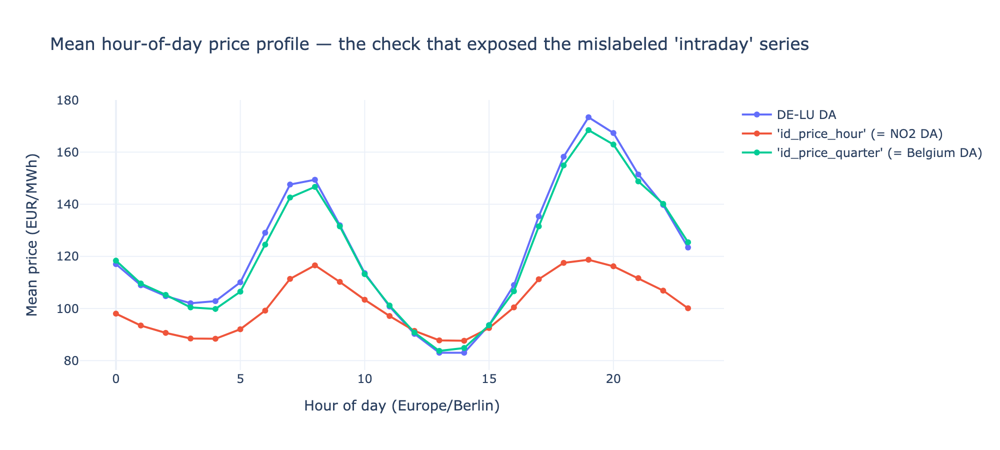

# BESS Arbitrage: Battery Dispatch Optimization on the German DE-LU Power Market

> **Public product:** German BESS Forecast Value Monitor — an interactive,
> reproducible decision tool for comparing the economic value of day-ahead
> forecast tiers. See [BUILDING_IN_PUBLIC.md](BUILDING_IN_PUBLIC.md) for the
> live roadmap, evidence standard and public changelog.

Linear-programming optimization of **battery energy storage (BESS) price arbitrage** in the German (DE-LU) day-ahead market, with an explicit, honest separation between the *perfect-foresight ceiling* and what is *actually executable* with information available at bid time.

## Thesis

A battery makes money by buying power when it is cheap and selling when it is expensive. The optimal schedule is trivial to compute **if you already know the clearing prices** — but bids for delivery day D are due at the D-1 12:00 EPEX auction, before those prices exist. This project quantifies the difference: it computes the perfect-foresight revenue ceiling, then the revenue of a bidder who schedules against the most recent *known* price curve (persistence), and reports the **gap**. That gap is the euro value of price-forecast quality — precisely what an asset-backed power-trading desk pays forecasting talent, data and models for.

This mirrors the skepticism of a sibling study on ML forecasting of the German DA–ID spread (ML vs. naive): headline numbers that assume knowledge of the future are the energy-trading equivalent of a backtest Sharpe of 80.

## Key Findings

All figures are **EUR per MW of installed power per year**, for a standard **2 MWh / 1 MW (2-hour) lithium-ion battery**, round-trip efficiency 0.85, throughput cost 2 EUR/MWh. DE-LU day-ahead auction, 2022-01 → 2026-06, 1,632 complete trading days (partial years annualized to 365 days).

| Year | Perfect foresight (ceiling) | Persistence D-1 | Persistence D-7 | Blend D-1/D-7 (rolling OLS) | Capture (D-1 / PF) | Capture (blend / PF) | Forecast-value gap (PF − D-1) |
|------|------:|------:|------:|------:|------:|------:|------:|
| 2022 | 88,593 | 61,732 | 65,086 | 65,497 | 70% | 74% | 26,862 |
| 2023 | 48,558 | 35,151 | 37,536 | 37,356 | 72% | 77% | 13,407 |
| 2024 | 60,583 | 47,317 | 48,370 | 50,922 | 78% | 84% | 13,266 |
| 2025 | 68,587 | 55,523 | 57,044 | 56,893 | 81% | 83% | 13,065 |
| 2026 (H1) | 79,506 | 67,439 | 63,961 | 68,553 | 85% | 86% | 12,067 |

All executable tiers (D-1, D-7, blend) use only information available at the D-1 12:00 auction. Full-sample average: ceiling ≈ 69.2k, persistence D-1 ≈ 53.4k, blend ≈ 55.8k EUR/MW/yr; capture 77% (D-1) / 81% (blend); gap ≈ 15.7k (D-1) / 13.3k (blend) EUR/MW/yr (see `data/processed/kpi_summary.json`).

*Note on 2026: since 2025-10-01 the DA auction clears in 15-minute periods; these figures use hourly averages, which smooth intra-hour spread — the 2026 ceiling is therefore conservative (see Limitations).*

### 1. Naive bidding already captures 70–85% of the ceiling — and the share is rising

A bidder who simply re-submits yesterday's price shape captures 70% (2022) → 85% (2026 H1) of perfect foresight. Post-crisis DE-LU prices have become more *autocorrelated and shape-regular* (solar-driven midday trough, morning/evening peaks), so the naive forecast keeps improving. The structural "duck curve" is the dominant, predictable signal — the same lesson as da-id, where most edge was structural, not model-driven.

### 2. The gap is the price of forecasting

Perfect price knowledge is worth **12k–27k EUR/MW/yr** over naive persistence (≈ 15.7k on average, ~23% of the ceiling). That is the rational budget for forecasting quality in day-ahead bidding — and an upper bound on what any DA price model can ever add for this asset.

### 3. The first, cheapest forecast model — a rolling-OLS blend — recovers ~15% of the gap

D-7 (same weekday last week) outperformed D-1 in 2022–2025: it captures weekday/weekend seasonality and averages out day-to-day noise. In 2026 H1 the ranking flips — recent price shape has become more informative than weekly seasonality. Since the relative strength of the two lags drifts, the natural next step is to *learn* the mix: the `blend` tier regresses the trailing 90 days of realized prices on their own D-1/D-7 curves (plus intercept) and applies the fitted weights to today's known curves — no lookahead, ~30 lines of code. It beats D-1 in every year, beats the better single lag in most years, and lifts full-sample capture from 77% to 81% — recovering ≈ 2.4k of the 15.7k EUR/MW/yr gap (~15%) for essentially zero model complexity. A useful yardstick: any *real* forecast model now has to beat the blend, not naive persistence.

### 4. The gap is (entirely) a shape problem, not a level problem

Decomposing the persistence gap by replacing the forecast's daily *level* with the true daily mean while keeping its intra-day *shape* (`src/backtest/decompose.py`, EUR/MW/yr, full sample):

| Tier | Gap (PF − tier) | Level cost | Shape cost | Shape share |
|------|------:|------:|------:|------:|
| Persistence D-1 | 16,157 | −283 | 16,440 | ~102% |
| Blend D-1/D-7 | 13,599 | −237 | 13,836 | ~102% |

(Gaps here are day-weighted full-sample means, so the D-1 gap reads 16.2k rather than the 15.7k mean-of-yearly-values in the findings table — same data, different weighting.) Knowing the true daily *mean* price is worth nothing — slightly negative, i.e. within noise: a constant price shift only touches battery revenue through the round-trip-efficiency wedge, so it barely changes the optimal schedule. **The entire forecast-value gap is hour-*ranking* error.** Practical consequence: a DA price model for battery dispatch should be trained and evaluated on intra-day shape (rank/spread), not on level-weighted metrics like RMSE — a model can improve RMSE materially while adding zero dispatch revenue.

### 5. Parameter sensitivity (perfect-foresight ceiling, sampled days, annualized)

| Round-trip efficiency | 0.70 | 0.85 | 0.95 |
|---|--:|--:|--:|
| EUR/MW/yr | 42,207 | 71,190 | 98,124 |

| Duration (h) | 1h | 2h | 4h | 8h |
|---|--:|--:|--:|--:|
| EUR/MW/yr | 39,463 | 71,190 | 112,063 | 134,459 |

| Throughput cost (EUR/MWh) | 0 | 2 | 10 | 20 |
|---|--:|--:|--:|--:|
| EUR/MW/yr | 75,758 | 71,190 | 55,963 | 42,176 |

Efficiency is a strong lever; duration shows diminishing returns past ~4h (the daily price shape only has so much exploitable spread); throughput/degradation cost erodes revenue roughly linearly and would be the swing factor in a real LCOS business case.

### 6. The gap is an *event* phenomenon: it lives on regime-change days

Before modeling, map the enemy (`src/backtest/gap_analysis.py`). Two results, full sample, persist_d1 tier:

- **Concentration.** The worst 10% of days hold **~40%** of the total gap; the worst 20% hold **~59%**. A forecast doesn't need to win every day — it needs to win a few hundred specific days.
- **Attribution.** Bucketing days by the rank correlation between the realized curves of D and D-1 (i.e. how wrong persistence's *shape* was): the lowest-correlation quintile holds **40%** of the gap, the highest-correlation quintile **5%** — *even though the calm quintile has the larger average daily spread* (157 vs 115 EUR). The gap is not "big-prize days"; it is precisely **days whose shape breaks with yesterday** — weather fronts, regime transitions, holiday boundaries.

### 7. Fundamental features recover two-thirds of the gap

The D-1-known information set is bigger than lagged prices: the TSOs publish **day-ahead forecasts of load, PV and wind** before the auction (SMARD filters 411/125/123/3791), and residual load (load − wind − solar) is what actually walks the merit-order curve. Two fundamental tiers (`src/forecast/`), same rolling-OLS walk-forward protocol as the blend, plus a walk-forward gradient-boosted model — all evaluated through the same LP, on the **common** 1,542 days where every tier trades:

| Tier | Information set | Capture | Gap recovered vs persist_d1 |
|------|-----------------|--------:|--------------------------:|
| persist_d1 | D-1 price curve | 77.6% | — (baseline) |
| persist_d7 | D-7 price curve | 79.6% | 9% |
| blend | D-1 + D-7 curves, rolling OLS | 81.9% | 19% |
| gbm | all below + calendar, HistGradientBoosting | 86.8% | 41% |
| rl_quad | **residual-load forecast only** (RL + RL²) | 89.8% | 55% |
| gbm_shape | gbm retrained on the demeaned daily curve | 90.2% | 56% |
| blend_rl | D-1 + D-7 + RL + RL² , rolling OLS | **92.3%** | **66%** |

Three observations worth defending in an interview:

1. **`rl_quad` uses no price history at all** — two regressors and an intercept, refit daily on a 90-day window — and it beats everything price-based. The DA price *shape* is not an autoregressive object; it is a merit-order readout of residual load. Feature choice beat model class.
2. **The GBM, given strictly more information, loses to a 4-regressor OLS.** Plausible reasons: it optimizes squared error on *levels* (finding 4 says levels are worthless), and it refits every 30 days on a 365-day window while the OLS re-calibrates daily on 90 days, so it drags stale regimes. The first hypothesis was tested directly: retraining the same GBM on the *demeaned* daily curve — telling it the game is shape, not level — lifts it from 86.8% to 90.2% capture (`gbm_shape`), closing most of its deficit in one move. It still trails `blend_rl`; a true ranking loss and faster refits are the next iterations. The honest headline stands either way: in this problem, one good fundamental feature and the right objective are worth more than model complexity.
3. **Weather-forecast *error* costs the fundamental tiers almost nothing in day-ahead.** A diagnostic tier running the rl_quad protocol on *realized* residual load (`rl_quad_pw`, "perfect weather") captures **88.5% — less than the forecast-based 89.8%**. Counterintuitive until you remember who sets the price: every auction participant bids off the same public TSO forecasts, so the DA price is a function of the *forecast*, not of the weather that later happens. Forecast errors get repriced in intraday and balancing, not in the DA auction. Two consequences: (a) better weather data is *not* where the remaining DA gap lives — the residual ~8% is mapping error (merit-order curvature drift, fuel prices, flows); and (b) this doubles as a leakage test: if the SMARD "forecasts" had been quietly revised toward actuals, actuals would have scored *higher*, not lower.
4. Per-year capture of `blend_rl` is monotone-rising: 90.9% (2022) → 96.5% (2026 H1). Given observation 3, the residual ~5–9% is mostly price-mapping error (merit-order drift, fuel prices, outages, flows) rather than weather uncertainty.

**Caveat (documented in `fetch_smard_forecasts.py`):** SMARD serves the *latest* snapshot of the TSO day-ahead forecast series without publication timestamps. These series are day-ahead publications by ENTSO-E convention, but revisions cannot be ruled out from SMARD alone — so treat the fundamental-tier numbers as an upper bound pending a point-in-time rebuild from ENTSO-E transparency data.

### 8. Event study — the June 2026 heatwave

Late June 2026: record European heat, AC load surge, French nuclear river-temperature derates, record June DA prices. Comparing 2026-06-19→29 with an equal-length early-June baseline (`src/backtest/heatwave_study.py`):

| | Early June | Heatwave | Ratio |
|---|--:|--:|--:|
| Mean daily spread (EUR/MWh) | 153 | 274 | 1.8× |
| PF ceiling (EUR/day) | 229 | 428 | 1.9× |
| Capture, persist_d1 | 71.8% | 98.6% | |
| Capture, rl_quad | 97.9% | 99.4% | |

Two lessons. First, a heatwave is a battery's best week — the prize nearly doubles (solar keeps the midday trough down while AC load and thermal derates lift the evening peak). Second — and against the naive narrative — **persistence captured 98.6% *inside* the event**: consecutive heatwave days resemble each other, so once the regime is established, yesterday's curve is an excellent forecast. The money for a forecast is at the **transitions** (onset/offset), exactly where finding 6 located the gap. Extreme *levels* are not the problem; *change* is.

## Live paper trading (started 2026-07-05)

The forward test of everything above — and the definitive answer to the snapshot-revision caveat. A daily job (`src/paper/paper_trade.py`, launchd, attempts at 09:35/10:45/11:40 + a 12:05 missed-day check, Europe/Berlin) fetches the TSO forecasts and price history, builds the tier ladder (persist_d1, blend, rl_quad, blend_rl), solves the dispatch LP per tier, and **freezes forecast + schedule to disk before the 12:00 gate closure**. The next day it settles the frozen schedules against realized auction prices and appends to a ledger. Because the forecasts are frozen pre-auction, they are point-in-time *by construction* — from here on, capture ratios accumulate genuinely out of sample.

Guards, because paper trading is only worth doing honestly:
- a bid is refused (and the day logged as missed, never back-filled) if the job fires after 12:00 — e.g. the machine was asleep;
- a delivery day is never bid twice;
- the SMARD live price source (filter 4169) was verified cent-exact against the study's ENTSO-E series on a 504-hour overlap.

Artifacts: `data/paper/bids/YYYY-MM-DD.json` (frozen bids), `data/paper/ledger.csv` (settled results). Run manually: `python -m src.paper.paper_trade`.

## Data-quality post-mortem: the "intraday" series that wasn't

An earlier version of this study reported an intraday-market tier built on a series inherited from the sibling da-id project, labeled *EPEX Intraday Index (SMARD)*. Its headline was suspicious on its face: the "intraday" perfect-foresight ceiling came out at *half* the day-ahead ceiling, while German intraday prices are in reality **more** volatile than day-ahead. Digging in:

1. **Symptom.** The mean hour-of-day profile of the "hourly ID index" was nearly flat (range ≈ 31 EUR vs. ≈ 90 EUR for DA) — no solar duck curve at all. No DE-LU delivery-period price can look like that.
2. **Fingerprints.** The companion "quarter-hourly ID index" had the full duck curve but matched the DE-LU DA price *to the cent* in 20% of all hours — a market-coupling signature, impossible for a volume-weighted index of intraday trades. It was also constant within each hour until October 2025 and quarter-varying afterwards: exactly the day-ahead 15-minute MTU switch.
3. **Root cause.** The upstream fetch labeled SMARD filters 4996/4997 as "Intraday Index". Per the official SMARD API specification, filter **4996 is "Marktpreis: Belgien"** (Belgian DA price, market-coupled to DE-LU) and **4997 is "Marktpreis: Norwegen 2"** (Norwegian NO2 DA price — hydro-dominated, hence the flat daily profile). SMARD publishes **no German intraday index at all**.
4. **Action.** The intraday tier was removed rather than re-labeled: no free, delivery-period German ID price series was available in-repo (EPEX indices are licensed; netztransparenz ID-AEP requires registration and is the planned next step). The study was reframed around the DA auction, where every number is real. The checks above now live in `src/data/validate.py` and run against the raw files, so a mislabeled series fails loudly instead of silently shaping conclusions.



*One chart tells the story: DE-LU DA and "quarter-hourly ID" (actually Belgium DA) share the duck curve; "hourly ID" (actually Norway NO2) is flat.*

## How it works — battery arbitrage as a linear program

Each delivery day is optimized independently over a 24-hour window (matching real day-ahead operation and keeping the LPs small). Per hour *t*, with Δt = 1h so MW ≡ MWh:

- Variables: charge `c_t ≥ 0`, discharge `d_t ≥ 0`, state of charge `s_t`.
- Objective: `max Σ (price_t·d_t·η_dis − price_t·c_t) − λ·Σ(c_t + d_t)`
- SoC dynamics: `s_t = s_{t-1} + c_t·η_ch − d_t/η_dis`
- Bounds: `0 ≤ c_t,d_t ≤ P_max`, `0 ≤ s_t ≤ E_max`, fixed start/end SoC.

Round-trip efficiency is split symmetrically: `η_ch = η_dis = sqrt(η_rt)`. Solved with **cvxpy** (CLARABEL). Looped over all 1,632 complete trading days.

**Tiers compared:**
- `pf_da` — optimize against the realized DA curve (perfect foresight; the ceiling).
- `persist_d1` / `persist_d7` — optimize the schedule against the D-1 / D-7 price curve (the latest curves actually known at the D-1 12:00 auction), submit as fixed quantities, settle at realized DA prices.
- `blend` — optimize against a rolling-OLS blend of the D-1/D-7 curves (weights fit on the trailing 90 days of already-cleared prices; equal-weight fallback while the window fills). Same schedule-then-settle mechanics; still zero lookahead.
- `rl_quad` / `blend_rl` — fundamental tiers: rolling OLS of realized prices on the SMARD **D-1 residual-load forecast** (RL + RL², optionally plus the D-1/D-7 curves), refit per delivery day on a 90-day window. Every regressor is published before the D-1 12:00 auction.
- `gbm` — walk-forward `HistGradientBoostingRegressor` on the same information set plus within-day RL rank/deviation and calendar features; refit every 30 days on a trailing 365-day window.

## Architecture

```
bess-arbitrage/
  config/settings.yaml        # battery params, dates, paths, persistence lags
  src/
    config.py                 # ROOT, load_config, get_logger
    data/load_prices.py       # load + clean DA hourly series, keep complete 24h days
    data/db.py                # SQL twin of the loader (DuckDB; portable to PostgreSQL)
    data/validate.py          # data-quality checks that exposed the mislabeled series
    data/fetch_smard_forecasts.py  # SMARD D-1 load/PV/wind forecasts -> residual load
    data/fetch_smard_actuals.py    # realized counterparts (labeling check, perfect-weather tier)
    data/validate_forecasts.py     # forecast-vs-realized labeling forensics
    data/health.py            # pre-flight health gate: fast local checks, auto-run
                              # by the backtest runner and the paper trader
    forecast/residual_load.py # fundamental tiers: rolling-OLS on residual-load forecast
    forecast/gbm_shape.py     # walk-forward gradient-boosted model (price or shape target)
    paper/paper_trade.py      # live paper trading: freeze bids pre-auction, settle daily
    optimize/lp_dispatch.py   # per-day cvxpy LP (BatteryParams, solve_day, DispatchResult)
    optimize/realistic.py     # executable tiers: persistence + rolling-OLS blend forecasts,
                              # schedule-then-settle
    backtest/revenue.py       # all-day loop, yearly summary, capture/gap findings table
    backtest/decompose.py     # forecast-value gap -> level cost vs shape cost decomposition
    backtest/gap_analysis.py  # where the gap lives: concentration, shape-change buckets
    backtest/forecast_tiers.py# evaluate forecast tiers through the same LP harness
    backtest/heatwave_study.py# June 2026 heatwave event study
    viz/plots.py              # Plotly charts (HTML+PNG) + structured KPI exports
  tests/                      # LP + executable-tier sanity checks (pytest)
  data/
    raw/                      # source parquet (data-only copy from da-id; no code dep)
    processed/                # charts (png/html), KPI csv/json, result tables
```

## Data

| Series | Source | Notes |
|--------|--------|------|
| DA hourly price `da_price` | ENTSO-E Transparency (via da-id-arbitrage) | DE-LU day-ahead auction, EUR/MWh |
| `id_prices.parquet` | SMARD filters 4996/4997 | **Not used in the backtest** — actually Belgium / Norway-NO2 DA prices (see post-mortem); retained for `validate.py` |
| `smard_forecasts.parquet` | SMARD filters 411/125/123/3791 | TSO **day-ahead forecasts** of load / PV / wind on-/offshore (-> residual load); the D-1-known fundamental features for the forecast tiers |

Coverage 2022-01-01 → 2026-06-29, Europe/Berlin tz; only complete 24-hour days are kept (DST transition days dropped). Per workspace rules, parquet files are copied into `data/raw/`; no code is imported from da-id.

### SQL access layer

`src/data/db.py` serves the same cleaned series through SQL (DuckDB embedded, so no server is needed; the queries are portable and run unchanged on PostgreSQL): raw table → dedup/hourly view (`ROW_NUMBER`, `date_trunc` + `AVG`) → complete-day query (`GROUP BY` local delivery day `HAVING COUNT(*) = 24`, via `AT TIME ZONE`). A data-quality report exposes DST transition days (23h/25h local days) and the raw file's granularity switch (24 → 96 rows/day at the 2025-10 15-minute MTU change) directly from SQL.

Two details worth calling out. Hour bucketing must happen on the *UTC instant*, not local wall time — otherwise the two 02:00 hours of the autumn clock change merge and 25-hour DST days masquerade as complete (the equivalence test caught exactly this). And `tests/test_db.py` pins the whole thing down: the SQL path must reproduce the pandas path row-for-row.

## Outputs (`data/processed/`)

Interactive `.html` (Plotly) + static `.png` for each chart:

- `dispatch_profile`, `soc_curve` — example high-spread day: schedule vs. price, SoC trajectory
- `revenue_by_year` — three-tier revenue comparison
- `capture_ratio` — executable / perfect-foresight by year
- `sensitivity` — revenue vs. efficiency, duration, throughput cost
- `data_quality_profiles` — the post-mortem diagnostic chart

Structured results: `kpi_yearly.csv` (tidy long format: year × tier × metric), `kpi_summary.json` (asset config + headline numbers), `findings_table.csv`, `yearly_summary.csv`, `daily_revenue.parquet`, `sensitivity_*.csv`, `gap_decomposition.csv` (level vs shape cost per tier and year), `lp_artifact_check.json` (simultaneous charge/discharge artifact quantification).

Forecast layer: `gap_analysis_daily.csv` + `gap_concentration_*.csv` + `gap_shape_buckets_*.csv` (where the gap lives), `forecast_tiers_daily.parquet`, `forecast_findings.csv`, `forecast_gap_recovery.csv` (tier ladder results), `heatwave_study.csv` (June 2026 event study).

## Limitations & honest caveats

- **Price-taker assumption.** The battery is assumed not to move the market. At fleet scale, charging/discharging compresses the very spreads it exploits.
- **Fixed-quantity bids.** Persistence tiers submit price-inelastic quantities; real bidders use limit/block orders that cap downside when the forecast is wrong, so persistence here is a *lower* bound on executable revenue. Conversely `pf_da` assumes the auction outcome is fully known — an upper bound.
- **No intraday / balancing revenue.** Real BESS stack intraday re-trading and FCR/aFRR on top of DA arbitrage; this models the DA auction only. Adding a genuine intraday leg (netztransparenz ID-AEP, 15-min) is the planned next step.
- **Hourly granularity vs. the 15-minute MTU.** Since 2025-10-01 the DE-LU day-ahead auction clears in 15-minute periods; this study uses the hourly series (the average of the four quarter prices). Averaging smooths intra-hour spread, so from Q4 2025 onward the perfect-foresight ceiling — and the revenue of any battery able to follow a 15-minute schedule — is **understated**. Capture ratios are less distorted because all tiers share the same smoothing, but the 2026 levels should be read as conservative.
- **SMARD forecast series are latest-snapshot.** The fundamental tiers use SMARD's TSO day-ahead load/PV/wind forecasts, which SMARD serves without publication timestamps. A dedicated labeling check (`python -m src.data.validate_forecasts`) proves they are *not* mislabeled copies of the realized series — forecast-vs-realized errors show the classic D-1 profile (load ≈ 3.9% MAPE, wind onshore ≈ 13.5%, exact-match rate ≈ 0%) — but post-auction *revisions* of a genuine forecast cannot be excluded from SMARD alone; the fundamental-tier results should be read as an upper bound until rebuilt from point-in-time ENTSO-E data.
- **Throughput cost is a stylized scalar.** True degradation is path-, depth- and temperature-dependent; λ is a single public-assumption proxy.
- **No binary against simultaneous charge+discharge.** A plain LP (not MILP) permits both flows in the same hour — physically impossible, and at negative prices the pair burns energy for money. Quantified (`python -m src.backtest.lp_artifact_check`): the pair only turns profitable below −2λ/(1−η_dis) ≈ **−51 EUR/MWh**; across the 300 negative-price days in the sample the solver used overlapping flows in 152 hours with a net contribution of **≈ −7 EUR over 4.5 years** — solver degeneracy, not a revenue exploit. A real dispatch system would add the binaries or net out overlaps in post-processing; for this study the LP is the right tool.
- **No transaction costs / taxes / grid fees** beyond the throughput penalty.

## Setup

```bash
python3 -m venv .venv            # Python 3.9 compatible
.venv/bin/python -m pip install -r requirements.txt

.venv/bin/python -m src.data.load_prices    # inspect cleaned price series
.venv/bin/python -m src.data.db             # SQL path: ingest + data-quality report
.venv/bin/python -m src.data.validate       # run the data-quality checks (post-mortem)
.venv/bin/python -m src.backtest.revenue    # full backtest, prints yearly findings (~90s)
.venv/bin/python -m src.backtest.decompose  # gap -> level/shape decomposition (~2min)
.venv/bin/python -m src.viz.plots           # regenerate all charts + KPI exports (~3min)

# forecast layer
.venv/bin/python -m src.backtest.gap_analysis        # where the gap lives (~2min)
.venv/bin/python -m src.data.fetch_smard_forecasts   # SMARD D-1 forecasts (~950 requests)
.venv/bin/python -m src.backtest.forecast_tiers      # tier ladder through the LP (~10min)
.venv/bin/python -m src.backtest.heatwave_study      # June 2026 event study (needs the above)

# data quality
.venv/bin/python -m src.data.health                  # pre-flight health gate (fast, local;
                                                     # also auto-runs inside the two consumers)
.venv/bin/python -m src.data.fetch_smard_actuals     # realized load/PV/wind (~950 requests)
.venv/bin/python -m src.data.validate_forecasts      # forecast labeling forensics (networked)

# live paper trading (runs daily via launchd, attempts at 09:35/10:45/11:40 + a 12:05 missed-day check, Europe/Berlin)
.venv/bin/python -m src.paper.paper_trade
```

## Interactive portfolio app

The Streamlit app turns the stored research artifacts into an explorable public
demo. It separates the historical model ladder from a one-day interactive LP,
and labels perfect foresight as a ceiling rather than an executable strategy.

```bash
.venv/bin/python -m pip install -r requirements.txt
.venv/bin/streamlit run app.py
```

The app reads only local, versioned research outputs. It does not require API
keys, credentials, live trading access, or personal account data.

The compact dataset required by the app is included under `data/public/`.
Raw research inputs are intentionally excluded; the two SQL equivalence tests
that require the original Parquet files are therefore skipped in a clean
public clone. All app and model unit tests remain runnable.

### Public data attribution

The app includes a compact, cleaned copy of the DE-LU day-ahead price series.
Source of publication: [ENTSO-E Transparency Platform](https://transparency.entsoe.eu/),
redistributed under CC BY 4.0. The transformation keeps complete hourly
delivery days, removes duplicate timestamps, and excludes DST transition days.
ENTSO-E does not sponsor or endorse this project.

## Tests

```bash
.venv/bin/python -m pytest tests/ -v
```

LP sanity (buys low / sells high, SoC bounds, efficiency loss, no-trade on flat prices, non-negative PF revenue, simultaneous charge/discharge only pays below the break-even price), executable-tier checks (persistence lag construction, no-forecast fallback, wrong forecast never beats perfect foresight), blend-forecast checks (no lookahead under future-data perturbation, equal-weight fallback, exact recovery of a periodic series), decomposition invariants (gap ≡ level cost + shape cost; pure level error has zero shape cost and is free for a lossless battery; pure shape error has zero level cost), SQL-layer equivalence (the DuckDB path reproduces the pandas loader row-for-row; the SQL report flags DST days and the MTU granularity switch), forecast-layer checks (rank-correlation descriptors, rolling-OLS exact recovery of a linear relation, NaN-features → no-trade days, and no-lookahead perturbation tests for the rolling OLS and both GBM targets), health-gate checks (flat-price/mislabeling, residual-load identity, solar-at-night, dead series), and paper-trading guards (no bids after gate closure, no double bids, frozen persistence forecast equals the D-1 curve).
